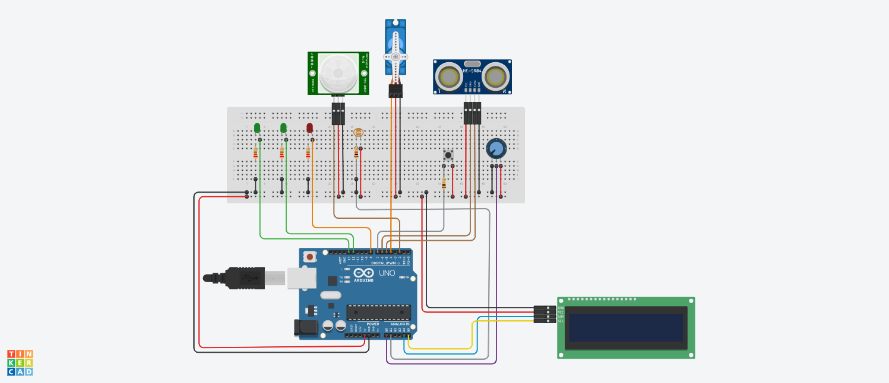

# SmartBridge

Second assignement for the Embedded Systems and IoT course at UNIBO; we want to realise an embedded system called Smart Bridge.
# Circuit Design

# Description 

The prototype  is meant to simulate a system mounted on a bridge, providing smart functionalities:
1. A first functionality is about  monitoring the water level of the river and, in the case of dangerous situations, opening some valves to let the water flow on some lands. 
2. A second functionality is about smart lighting, automatically turning on/off a light on the bridge depending on the presence of people traversing the bridge.

The breadboard of the prototype includes two green leds LA and LB, a red led LC, a tactile button B, a potentiometer Pot, a servo-motor M, a sonar S, a pir P, a light sensor LS, an LCD. The embedded system is connected to the PC (Console) through the serial line. 

The pir P, light sensor LS, led LA are part of the subsystem used to realise the smart lighting behaviour:
* If someone is detected on the bridge  by P, then the light LA  should be either turned on or not depending on the light level as measured by LS. 
* If the level is less than some threshold THL, then the light LA is turned on, otherwise the light is not turned on. 
* The light is turned off either after some time T1 in which no one was detected on the bridge by P, or the level of luminosity becomes higher than the threshold THL.

The sonar S, motor M, potentiometer Pot, the leds LB and LC , the button B and the LCD are part of the subsystem used to monitor the water level and eventually take actions in case. In particular:
 * the sonar S is used to continuously measure the river level  (by measuring the distance from the water surface). 
* The motor M is meant to control the opening/closing of a valve to allow the river water to flow – 0° degrees corresponds to valve closed and 180° corresponds to fully open valve.

When the river water level is below a water level WL1 the system is in a normal situation:
* The green led LB is on and LC is off – it means that the bridge can be used. 
* In this situation, the sampling of the water level measure should be done every period PEnormal 

When the water level is higher than WL1 and below a level WL2, the system is in a pre-alarm situation: 
* The red led LC starts blinking with a period of 2 seconds.  
* Sampling must be done with a period PEprealarm (< PEnormal)
* The LCD is turned on, informing about the pre-alarm and displaying the current water level

When the water level is higher than WL2 up to WLMAX, the system is in an alarm situation:
* The smart lighting subsystem is turned off (the led LA must be off)
* The green led LB  is turned off and the red led LC is on (without blinking)
* Sampling must be done with a period PEalarm (< PEprealarm)
* The valve must be opened of some ALPHA degrees ( 0 < ALPHA < 180), whose value linearly depends on the the current water level, WL2 and WLMAX (so 0 degrees corresponds to WL2 and 180 degrees correspond to WLMAX). The opening of the valve changes dynamically depending on the current water level
* The LCD is still on, informing about the alarm situation and displaying both the current water level and the opening degrees of the valve 
* In the alarm situation, a human user can take the control of the valve by pressing the button B, then using the potentiometer Pot to control the opening (degrees, from 0 to 180) and then pressing again the button B to stop controlling manually. 

The program running on the PC Console should:

[basic version] just report the current state of the bridge, either using a GUI or a text-based output
- if the smart light are either on or off
- normal/pre-alarm/alarm situation  

[complete version] like simplest, plus:
- a graph reporting the temporal trend of the water level  

[full-fledged version] like complete, plus:
- in the alarm state, the possibility to take control of the valve (like it happens with the button B and Pot)
